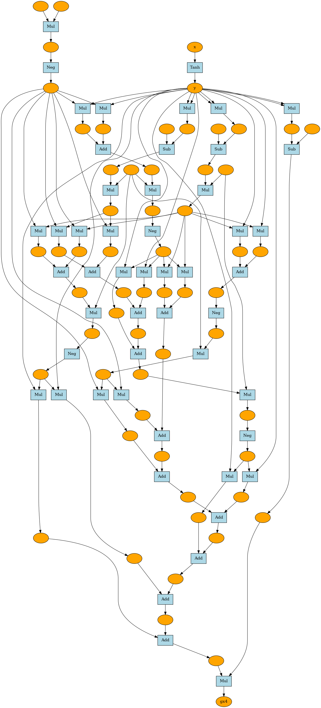

# yonex

『ゼロから作る Deep Learning ❸』の再現実装。

## how to install

### python package
```bash
pip install git+http://github.com/yonesuke/yonex.git
```

### visualization
install graphviz, for Windows or macOS, see the official site.

```bash
sudo apt update
sudo apt install graphviz
```


## examples

### Tanh

tanh関数の4階微分の計算グラフの可視化


